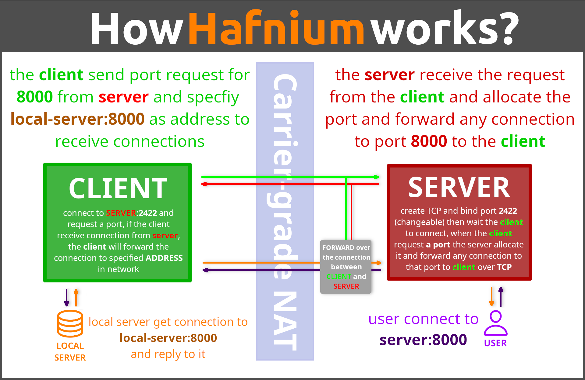

# Hafnium
Hafnium is reverse proxy, it use to expose local port over nat (ex. CGNAT)

# How it work

# Features

### Core Features To-Do

#### Key Management
- [x] Implement `hf genkey` command
  - [x] Generate private/public key pairs
  - [x] Store keys securely
  - [x] Export public key in shareable format

#### Server-side Features
- [ ] Implement server core functionality
  - [x] Create TCP/UDP server listener
  - [ ] Handle client connections (including forward of data)
  - [ ] Implement public key authentication

- [ ] Implement port management commands
  - [ ] `hf allow <port> [tcp/udp]`
  - [ ] `hf disallow <port> [tcp/udp]`
  - [ ] Default allow-all ports mechanism

- [ ] Implement connection management
  - [ ] `hf list peers`
  - [ ] `hf list ports`
  - [ ] `hf disconnect [peer_public_key]`

- [ ] Configuration system
  - [ ] `hf config get <key>`
  - [ ] `hf config set <key> <value>`
  - [ ] Implement persistent configuration storage

#### Client-side Features
- [ ] Implement client core functionality
  - [x] `hf connect <ip_address>:<port> <public_key>`
  - [ ] Handle connection authentication
  - [ ] Maintain persistent connection

- [ ] Port forwarding features
  - [ ] `hf open <port> [tcp/udp]`
  - [ ] `hf close <port> [tcp/udp]`
  - [ ] Port forwarding logic implementation

- [ ] Client utilities
  - [ ] `hf list peers`
  - [ ] `hf list ports`
  - [ ] `hf disconnect`

### Technical Infrastructure
- [ ] Set up project structure
- [ ] Implement logging system
- [ ] Error handling
- [ ] Connection security
- [ ] Network protocol design
- [ ] Documentation
  - [ ] Installation guide
  - [ ] Usage documentation
  - [ ] API documentation

# License
the code license is `AGPL-3.0` [read more](LICENSE).